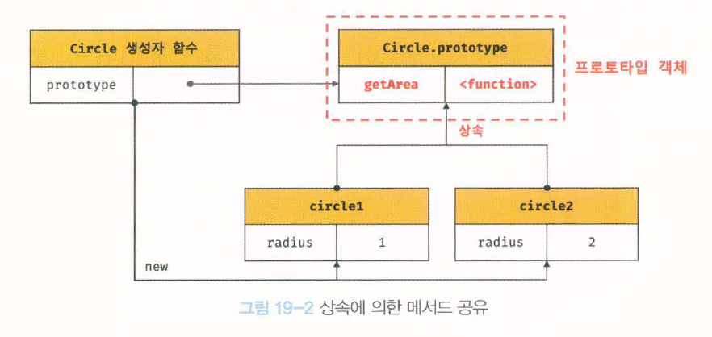

# 19장 프로토타입

자바스크립트

- 명령형, 함수형, 프로토타입 기반 객체지향 프로그래밍을 지원하는 **멀티 패러다임 프로그래밍 언어**
- 자바스크립트를 이루고 있는 거의 “모든 것”이 객체 → 원시타입의 값을 제외한 나머지 값들은 모두 객체

> **클래스(class)** <br>
ES6에서 클래스 도입.
기존 프로토타입 기반 객체지향 모델 그대로임.
클래스도 함수, 기존 프로토타입 기반 패턴의 문법적 설탕.
클래스와 생성자 함수는 모두 프로토타입 기반의 인스턴스를 생성하지만 정확히 동일하게 동작하지는 않음. 클래스는 생성자 함수보다 엄격, 클래스는 생성자 함수에서는 제공하지 않는 기능도 제공함.
따라서 클래스를 프로토타입 기반 객체 생성 패턴의 단순한 문법적 설탕으로 보기보다는 새로운 객체 생성 메커니즘으로 보는 것이 좀 더 합당하다고 할 수 있음.
클래스 → 25장
> 

## 19.1 객체지향 프로그래밍

### 객체지향 프로그래밍

여러 개의 독립적 단위, 즉 객체(object)의 집합으로 프로그램을 표현하려는 프로그래밍 패러다임.

객체지향 프로그래밍은 실세계의 실체를 인식하는 철학적 사고 → 프로그래밍에 접목.

실체는 특징이나 성질을 나타내는 속성(attribute, property)을 가지고 있고, 이를 통해 실체를 인식하거나 구별할 수 있음. → 프로그램에 필요한 속성만 간추려 표현하는 것을 **추상화**라고 함.

### 객체

속성을 통해 여러 개의 값을 하나의 단위로 구성한 복합적인 자료구조.

```jsx
const circle = {
	radius: 5, // 반지름

	// 원의 지름: 2r
	getDiameter() {
		return 2 * this .radius ; 
	},

	// 원의 둘레: 2πr 
	getPerimeter() {
		return 2 *Math.PI *this.radius; 
	},

	//원의 넓이: πrr 
	getArea () {
		return Math.PI *this.radius **2; 
	}
};

console .log(circle);
// {radius: 5, getDiameter: f, getPerimeter: f, getArea: f}

console.log(circle. getDiameter()); // 10 
console.log(circle.getPerimeter()); // 31.41592653589793 
console.log(circle.getArea()); // 78.53981633974483
```

- 반지름 : 원의 상태(state)를 나타내는 데이터
- 원의 지름, 둘레, 넓이 구하는 것 : 동작(behavior)

객체지향 프로그래밍은 객체의 상태를 나타내는 데이터와 상태 데이터를 조작할 수 있는 동작을 하나의 논리적인 단위로 묶어서 생각.

객체는 **상태 데이터**와 **동작**을 하나의 논리적인 단위로 묶은 복합적인 자료구조.

- 프로퍼티(property) : 객체의 상태 데이터
- 메서드(method) : 동작

**특징**

1. 각 객체는 고유의 기능을 갖는 독립적인 부품.
2. 자신의 고유한 기능을 수행하면서 다른 객체와 관계성을 가질 수 있음.
3. 다른 객체와 메시지를 주고받거나 데이터 처리 가능.
4. 다른 객체의 상태 데이터나 동작을 상속받아 사용 가능.

## 19.2 상속과 프로토타입

### 상속(inheritance)

어떤 객체의 프로퍼티 또는 메서드를 다른 객체가 상속받아 그대로 사용하는 것.(객체지향 프로그램의 핵심 개념)

자바스크립트는 프로토타입을 기반으로 상속을 구현 → 불필요한 중복 제거(기존 코드 재사용).

```jsx
// 생성자 함수
function Circle (radius) {
	this.radius = radius;
	this.getArea = function ( ) {
		// Math.PI는 원주율을 나타내는 상수다.
		return Math.PI * this.radius ** 2 ;	
	} ;
}

// 반지름이 1 인 인스턴스 생성
const circle1 = new Circle( 1 );
// 반지름이 2인 인스턴스 생성
const circle2 = new Circle( 2 );

// Circle 생성자 함수는 인스턴스를 생성할 때마다 동일한 동작을 하는
// getArea 메서드를 중복 생성하고 모든 인스턴스가 중복 소유한다.
// getArea 메서드는 하여 생성하여 모든 인스턴스가 공유해서 사용하는 것이 바람직하다.
console.log(circle1. getArea === circle2. getArea ) ; // false

console.log(circle1. getArea( ) ) ; // 3.141592653589793
console.log(circle2. getArea( )) ; // 12.566370614359172
```

Circle 생성자 함수로 인스턴스를 생성할 때마다 getArea 메서드 중복 생성, 모든 인스턴스가 중복 소유.

동일한 메서드를 중복 소유하는 것은 메모리 낭비, 인스턴스 생성할 때마다 메서드를 생성하므로 퍼포먼트에도 악영향

⇒ 상속을 통해 불필요한 중복 제거.

### 프로토타입(prototype)

자바스크립트는 프로토타입(prototype)을 기반으로 상속을 구현.

```jsx
// 생성자 함수
function Circle (radius) {
	this.radius = radius;
}

// Circle 생성자 함수가 생성한 모든 인스턴스가 getArea 메서드를
// 공유해서 사용할 수 있도록 프로토타입에 추가한다.
// 프로토타입은 Circle 생성자 함수의 prototype 프로퍼티에 바인딩되어 있다.
Circle.prototype.getArea = function () {
	return Math.PI * this.radius ** 2;
};

// 인스턴스 생성
const circle1 = new Circle(1);
const circle2 = new Circle(2);

// Circle 생성자 함수가 생성한 모든 인스턴스는 부모 객체의 역할을 하는
// 프로토타입 Circle.prototype으로부터 getArea 메서드를 상속받는다.
// 즉, Circle 생성자 함수가 생성하는 모든 인스턴스는 하나의 getArea 메서드를 공유한다.
```



Circle 생성자 함수가 생성한 모든 인스턴스는 자신의 프로토타입(Circle.prototype)의 모든 프로퍼티와 메서드(getArea)를 상속받음.

⇒ 자신의 상태를 나타내는 radius 프로퍼티만 개별적으로 소유하고 getArea 메서드는 상속을 통해 공유.

<u>공통적으로 사용할 프로퍼티나 메서드를 프로토타입에 미리 구현해두면 인스턴스는 별도의 구현없이 상위(부모)객체인 프로토타입의 자산을 공유해 사용 가능.<u>(코드 재사용)
