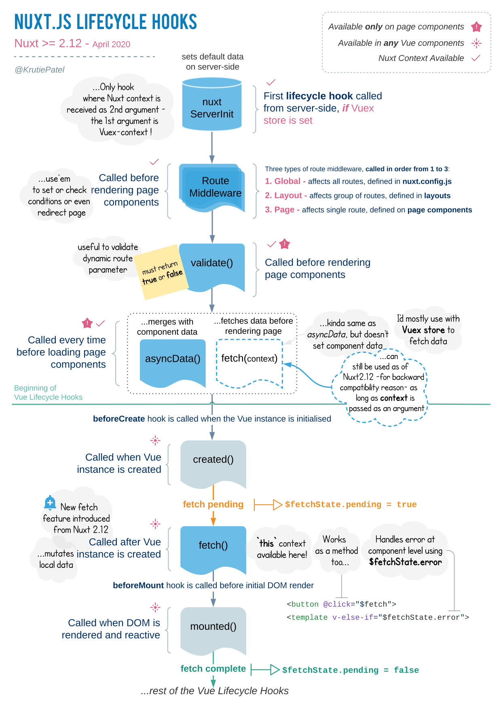

# Nuxt Lifecyele

## nuxtServerInit
- Universal 모드에서 사용할 수 있는 Store Action 메서드.
- SSR 시점에서 맨처음 실행.
- Store에 미리 정보를 담기 위한 비동기 통신을 요청할 때 주로 사용.
- 파라미터 : 스토어 컨텍스트, 넉스트 기본 컨텍스트

## middleware
- 페이지 또는 레이아웃을 렌더링하기 전에 실행할 기능 정의.
- 주로 로그인 체크, 유효성 검사 등에 활용.
- 하나의 js 파일에 정의함.
- 전체 페이지 적용시, nuxt.config.js 설정 파일의 router 옵션 사용.
- 해당 페이지 적용시, 컴포넌트에서 middleware 옵션 추가.

## validate
- _id.vue 등 동적 라우팅 페이지에 사용됨.
- 파라미터는 { params, query, store } 의 객체 형태.
- Data 세팅보다 유효성 검사 목적이 큼.
  ➡️ Bloean 값 반환해야함. false 일 때, error.vue 페이지로 이동.

## asyncData
- API 데이터를 초기에 가져와 세팅하는 역할.
- page에서만 사용가능.
- validate 다음에 호출.
- 컴포넌트가 렌터링되기 전의 시점 ➡️ this 사용 불가.
- 컴포넌트 data와 merge됨.
- 파라미터 : Nuxt context(router, store 등)

## fetch
- API 데이터를 컴포넌트가 아닌 Store(Vuex)에 세팅하는 역할.
- 파라미터 : Nuxt context(router, store 등)
